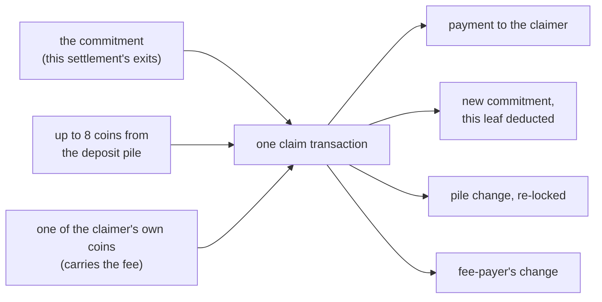

# Appendix: settlement and exit mechanics

Chapter 4 kept the settlement and the exit to what they attest and pay,
and chapter 5 kept the block model to its simplified form; this page
carries the mechanics a careful reader asks about next. Nothing here
changes the design; it is the same machine, closer up.

## What counts as one block

Chapter 5 treats one selected-chain block as one block to the machine.
The full rule: a block on the selected chain absorbs the parallel
blocks consensus folds into it, its *mergeset*, and the transactions
those parallel blocks carry count as part of that step, provided they
were not counted in an earlier step. One chain block plus its
mergeset's uncounted transactions is one block to the machine: one
witness set, one batch, one step of execution. The dag's parallelism
is flattened before execution begins, which is why the rest of the
book can speak of a plain sequence of blocks.

## Snapshot claims, chained

A settlement records one verified snapshot: at block Y,
the state digest was D. The proof inside shows how the digest got there,
root by root, from block X to block Y, where X is the previous
settlement's proof point. The windows are contiguous, each proof's
journal continuing exactly where the last one ended, so no block range
goes unwitnessed. The settlement transaction itself lands at least one
block after Y, and sometimes later: the gap is proving time plus the
confirmation window the cited blocks must pass, before the settlement is
even submitted. Each settlement commits one more provable snapshot.

## Can a range be skipped?

No. Each proof's journal picks up exactly where the previous one ended,
at its lane tip, and the settlement names the tip it proves to. Skip a
stretch of the lane and the two tips no longer meet: the next proof
would claim a tip it never reached. The bind is checked on-chain:
Kaspa's block headers carry a commitment to every active lane
([KIP-21](https://github.com/kaspanet/kips/blob/master/kip-0021.md)),
and the settlement script requires the proof's journal to commit the
same value the chain carries for the block it names. A skipped range
fails that check, so a settlement cannot leave a hole.

## What if cited blocks reorganize?

The proving pipeline has tiers (chapter 7 lists the three guests), and a reorg
invalidates only what stood on the reorganized side. Bundles whose
proving base was rolled back are thrown away and rebuilt against the
surviving chain, reusing the
lower-tier proofs that still chain; a settlement removed by a reorg
before it is confirmed is simply resubmitted. Proof cancellation is
the pipeline stopping work on bundles whose base was rolled back. The
invariant: only the bundle covering the surviving chain is generated
and settled; a canceled bundle is at most kept for its still-valid
parts, and when cancellation is working it is never generated at all.
This is
rare by construction: the machine only cites blocks already behind its
confirmation window (chapter 5).

## The anchor window and the long stall

The opcode that reads lane commitments (KIP-21's, a different one
from the [KIP-16](https://github.com/kaspanet/kips/blob/master/kip-0016.md) opcode that verifies proofs) has a reach limit: it serves
commitments only from a recent window of blocks, roughly the last
twelve hours' worth, so a
settlement cannot cite an anchor older than that. A machine stalled longer
than that must first prove its way forward to a recent block, then
settle. The chaining shape is what makes that recovery possible: a proof
window can span many blocks, so the backlog drains in larger windows, at
the price of later snapshots.

## An exit claim, up close

Chapter 4 kept exits to the leaf and the payout; here is the claim
transaction itself. It pulls in the commitment UTXO, up to eight whole
coins from the program's deposit pile (only the exit script can unlock
them; the claim wallet picks which, and eight is its cap), and one
ordinary coin of the builder's own to carry the fee. The outputs: the leaf's value paid to the lock the
leaf names, the pile's untouched change re-locked at the same script for
the remaining claimants, a fresh commitment with this leaf deducted for
the next claimant, and the unspent part of the fee coin back. The
commitment is a self-updating UTXO: each claim spends it and hands the
next claimant a tree with one less leaf.

Who builds a claim is economics, not protocol. The user can build it
and pay the fee; anyone can offer claims as a service; an operator who
benefits from working exits can subsidize them. The script accepts a
valid claim from whoever submits one.

## Exit contention and pile maintenance

Claims against the same commitment are spends of one coin, so they
conflict: two claims racing in the mempool behave like any double-spend.
One wins; the other's transaction can no longer confirm (its input is
gone), and the wallet rebuilds it against the new commitment once it
sees the winner. Claims against different settlements' commitments are
independent and pay out in parallel. The machine watches landed claims
to update its own books, marking exits claimed in program state, not
as an additional safety check, and a malformed claim fails its own
validation without
blocking later claims. What does not ship is a sweeper for the pile itself:
every claim splits what it sweeps, the network's dust rules floor how
small the pieces can get, and keeping the pile in spendable coins is
operational work.
