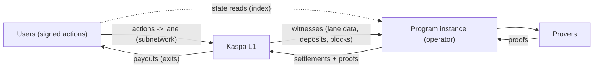

# Based rollup on Kaspa

## The one-sentence version

A based rollup moves a program *off* the L1: its state, its rules, and
its execution. It keeps *enforcement* on the L1: every state change
worth trusting is proved and settled back to Kaspa. That off-chain half
is the **L2**: the program itself, using Kaspa for what it must not
provide itself.

What each side carries follows from that. Ordering is the L1's: users
publish straight to the program's lane, and the chain's own order is
the order. Verification is the L1's: consensus checks every
settlement's proof before it counts. Enforcement is the L1's: payouts
move only through scripts Kaspa itself executes. That is the whole
sense of *based* here: the app runs directly on its L1, with nothing in
between. The state itself is the one thing the L1
does not carry: it holds a single 32-byte fingerprint of it ([The transaction vocabulary](transactions.md)),
so the full data behind that fingerprint, every account, balance, and
game, is stored and served by an L2 provider, the operator's node. The
actions and deposits do sit fully on the chain, in the lane. No external
committee, no data-availability service, and no bridge token (no new
coin standing in for the locked KAS) sits in between. One qualifier:
ordinary Kaspa nodes prune old block bodies, so data from far enough
back is served by archival peers, and what they serve checks against
the chain's headers ([the appendix](appendix-kaspa-depth.md#reconstructing-the-program-from-l1)).

A note for readers from the Ethereum ecosystem (others can skip this
paragraph): in Ethereum discourse "based" means L1 proposers do the
sequencing. Here nobody sequences at all; ordering is not a service:
users publish actions straight to the lane, and the L1's own order *is*
the order. One Ethereum connotation does not transfer: there, based also
comes with forced inclusion, an L1 path that makes the rollup process your
transaction even if the sequencer refuses. This machine ships no such
forced path; the liveness limits are [The machinery](machinery.md)'s. Readers who prefer the
established name for this shape will find it in [Single sovereign apps](single-sovereign-apps.md): a sovereign
app.

The shape of the whole system fits in one diagram:

Users sign actions and submit them to the program's lane on Kaspa
*themselves*: the lane is an L1 subnetwork that serves as the program's
public inbox and its data availability. The operator is not in the loop
for submissions: it reads the lane and the chain directly and executes
actions off-chain. Provers produce cryptographic proofs that the
execution followed the program's rules. Settlements, carrying those
proofs and commitments to the new state, land on Kaspa. Money flows back
out to users through exits, enforced by those settled proofs.

One arrow in the diagram needs a note: apps read current state from the
operator's index (the dashed line), not from Kaspa directly. The index
is a convenience, not the authority; [Building an app on it](building-an-app.md#how-far-can-you-verify-a-read) covers what a skeptic can
do without it.

## The two limits, and the extensions that change them

Kaspa's script engine is real and richer than Bitcoin's: it concatenates,
hashes, does arithmetic, inspects its own transaction's inputs and
outputs, and, since [KIP-16](https://github.com/kaspanet/kips/blob/master/kip-0016.md), verifies zk proofs. Ecosystem projects
(SilverScript, Argent among them) are building higher-level abstractions
over it. The claim that Kaspa has "no smart contracts because no
scripting" is wrong. The limits are structural, and there are two.

First, Kaspa runs on UTXOs: every coin is an output consumed by exactly
one transaction, and no other transaction can reference it afterward.
Shared state has no native home, so a program must carry its pot, board,
and balances forward output by output (abstractions like SilverScript
make the threading easier; it is still manual work).

Second, the script language is deliberately not Turing-complete (it
cannot run arbitrary programs, only check fixed shapes): flexible enough
to lock and check, not to *be* an application.

Both limits are deliberate design choices: they keep the chain fast and
simple to reason about. Both also received protocol extensions through
Kaspa's own proposal process (KIPs, the network's improvement
proposals), activated on Kaspa mainnet by the Toccata hard fork, a
coordinated upgrade. [KIP-20](https://github.com/kaspanet/kips/blob/master/kip-0020.md) added covenant ids, so scripts can bind
outputs to one program instance's identity. [KIP-21](https://github.com/kaspanet/kips/blob/master/kip-0021.md) added lane
commitments: every block header carries a commitment to the active
lanes' entries, so a lane's history is committed in the chain's
headers and reconstructible from the chain itself
([How it all chains](chaining.md) has the mechanism). Proof verification is
therefore a consensus rule, not a service: every Kaspa node that
executes a settlement runs the check, and a bad-proof settlement is
invalid, rejected like a bad signature. The check is verification, not
re-execution: small for every node, and priced into the settlement's own
transaction like any script work. Which proof system and which program
version to trust are not choices made at spend time; they are baked into
the covenant's script hash itself, which [The transaction vocabulary](transactions.md) opens up.

Where this lives today: those extensions are **implemented and
activated on Kaspa mainnet**. The live demo settles on **public
testnet-10** (mined by its public miners), and that is a deployment
choice, not a protocol gap: a demonstration belongs on a demonstration
network, with deliberately looser security assumptions. Every vprogs
settlement you can watch today is a testnet fact; what separates the
demo from a mainnet deployment is operational work, not protocol
activation.

With these three extensions ([KIP-16](https://github.com/kaspanet/kips/blob/master/kip-0016.md) from above, plus [KIP-20](https://github.com/kaspanet/kips/blob/master/kip-0020.md) and
[KIP-21](https://github.com/kaspanet/kips/blob/master/kip-0021.md)), a based rollup removes both limits, KIP-16 doing the
verification of arbitrary rules and [KIP-20](https://github.com/kaspanet/kips/blob/master/kip-0020.md) with [KIP-21](https://github.com/kaspanet/kips/blob/master/kip-0021.md) giving one
instance's scattered outputs a shared identity and its data a
canonical order: the
program's state lives inside the proof, in whatever shape the program
defines, and the rules can be arbitrary code, because the chain never runs
them; it verifies a compact proof and moves money according to the
result. The L1 stays simple; the applications do not have to be.

## What are you actually trusting?

Every design for "a game with a pot" answers the same question: who
could steal, and what stops them?

| Model | Who holds the pot | What stops them stealing | What's left to trust |
|---|---|---|---|
| **Custodial referee** | The operator | Reputation, law | Everything: they can just take it |
| **Multisig escrow** | A set of signers | M-of-N honesty | The majority of signers, and their liveness |
| **Zk-proven program** | The L1 itself | Proofs the L1 verifies | The code being proved, the zkVM and verifier opcode underneath it ([The zkVM, briefly](zkvm.md)), and that someone keeps the machine running |

Moving down the table removes trust in *people* one layer at a time.
The zk-proven model's key property is that "did the execution follow the
rules?" stops being a question about anyone's honesty: the operator can
be anyone and still cannot produce a settlement for a state the
program's rules don't allow. The proof either verifies on Kaspa or
the settlement doesn't happen.

One more point the table compresses: the deposit pile, many separate
coins locked at the one deposit address, is pooled custody at a
script, and its safety is exactly the safety of the pinned code,
bugs included. A rule-set bug that pays the wrong recipient drains the pile
through perfectly valid proofs. That is what "trusting the code" means,
and it is why the pinning in [The transaction vocabulary](transactions.md) matters.

What remains is a different kind of trust: **[liveness](words.md#liveness)** and **[data
availability](words.md#data-availability)** (you can see the state you need to act). Liveness: a
settlement only exists if someone executes actions and settles proofs,
and today that someone is the operator. No permissionless escape-hatch
flow is shipped yet either: if every operator of an instance stops
before your balance has become a committed exit, your funds wait until
someone resumes the stack. [The machinery](machinery.md) and [Building an app on it](building-an-app.md) cover who can resume, at
what cost.

## The shape and the rules

One idea runs through the rest of the book:

> **The rollup fixes the shape; the program picks the rules.**

The framework fixes the *shape* of the machine: user actions are signed,
state changes are proved, settlements land on Kaspa, money leaves only
through enforced exits. But the *rules* (what a deposit requires, who may move
which funds, how the state is derived, even how exits work) are choices
made by each program. vprogs ships working implementations of all of
them (deposit logic, lockers and signers, the permission tree, the exit
mechanism); treat each as a battery: a standard part you can use as-is
and, in principle, replace with a different design.

The [next chapter](transactions.md) covers the handful of transaction types everything else
is built from.
