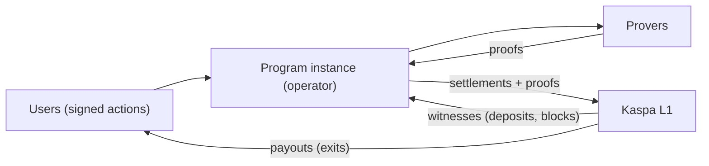

# Based rollup on Kaspa

## The one-sentence version

A based rollup moves a program *off* the L1 — its state, its rules, its
execution — but keeps its *enforcement* on the L1: every state change worth
trusting is proved and settled back to Kaspa. "Based" means the app leans
directly on its own settlement layer — there is no external committee, no
alternative DA layer, no bridge token standing between the program and the
chain that actually pays out. Kaspa is the bedrock; the rollup is the
building on top of it.

The shape of the whole system fits in one diagram:

Users sign actions and hand them to a program instance run by an operator.
The operator executes them off-chain. Provers produce cryptographic proofs
that the execution followed the program's rules. Settlements — carrying
those proofs and commitments to the new state — land on Kaspa. Money flows
back out to users through exits, enforced by exactly those settled proofs.

## Why Kaspa?

Kaspa is a proof-of-work L1 with a blockdag rather than a chain: many blocks
per second, woven into a single consensus ordering. It is fast at the thing
it does. The thing it does is deliberately small — transferring KAS under a
few standard lock types (think P2PK-style and P2SH-style scripts). There is
no virtual machine on the chain, no contract language, no place to put
application logic.

That minimalism is not an accident to be fixed; it is a design choice.
Keeping the L1 tiny is what lets it stay fast and simple to reason about.
The cost is that programmability has to come from somewhere else. A based
rollup is that somewhere else: instead of the chain *running* your program,
someone runs it off-chain and *proves* it, and the chain only has to verify
a compact proof and move money according to the result. The L1 stays small;
the applications don't have to be.

## What are you actually trusting?

Every design for "a game with a pot" answers the same question: who could
steal, and what stops them? It's a spectrum:

| Model | Who holds the pot | What stops them stealing | What's left to trust |
|---|---|---|---|
| **Custodial referee** | The operator | Reputation, law | Everything: they can just take it |
| **Multisig escrow** | A set of signers | M-of-N honesty | The majority of signers, and their liveness |
| **Zk-proven program** | The L1 itself | Proofs the L1 verifies | Only the code being proved, and that someone keeps the machine running |

Moving down the table removes trust in *people* one layer at a time. The
zk-proven model's trick is that "did the execution follow the rules?" stops
being a question about anyone's honesty — the operator can be a complete
stranger, run on junk hardware, in a bad mood, and still cannot produce a
settlement for a state the program's rules don't allow. The proof either
checks out on Kaspa or the settlement doesn't happen.

What *remains* is a different kind of trust: liveness (someone sequences
actions and settles proofs — and exits exist so users are never trapped
waiting for that someone), and data availability (you can see the state you
need to act). We'll meet both again, with their machinery, in the chapters
ahead.

## The shape and the rules

One idea runs through everything that follows, and it is worth stating
plainly now:

> **The rollup fixes the shape; the program picks the rules.**

The framework fixes the *shape* of the machine: user actions are signed,
state changes are proved, settlements land on Kaspa, money exits through
enforced doors. But the *rules* — what a deposit requires, who may move
which funds, how the state is derived, even how exits work — are not laws
of nature. They are choices made by each program. vprogs ships solid,
ready-to-use implementations of all of them (deposit logic, lockers and
signers, the permission tree, the exit mechanism) — treat each as a
battery: a standard part you can use as-is, and in principle replace with
a different design.

That is the whole difference between "a chain with contracts" and "a
program with its own proved world". The next chapter starts the tour where
it matters most: the handful of transaction types everything else is built
from.
