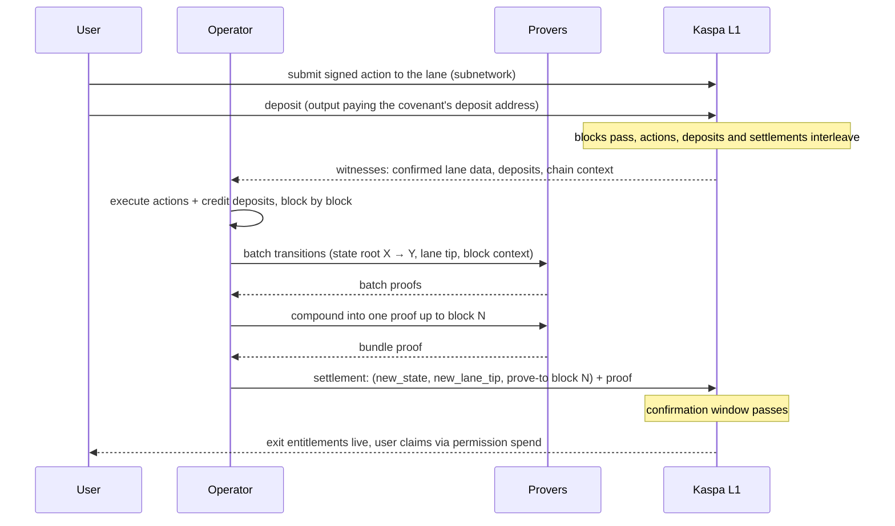

# How it all chains

This chapter is the spine of the whole book. Every piece from the last
chapter (settlements, the lane, user actions, deposits, the permission
tree) now moves at once, across multiple L1 blocks, tied together by
proofs.

Vocabulary check before it piles up: a *witness* is confirmed L1 data fed
to execution; a *batch* is the work over one block; its proof is a *batch
proof*; runs of batches compound into *aggregate* proofs; and the one a
settlement carries, the last aggregate, is the *bundle proof*. Five
words, one pipeline.

## State digests succeed each other

Inside the machine, time is a sequence of state roots. Every executed block
produces a journal entry of exactly this form: *previous state root, new
state root, previous lane tip, new lane tip, the L1 context it saw*. A
batch proof attests one such transition. An aggregate proof compounds a
run of them. A settlement then plants the final root on L1. So the
program's entire history is a chain of 32-byte numbers, each one provably
reachable from the one before, and that chain is anchored, link by link,
in the settlement chain living in Kaspa blocks.

## Why multiple L1 blocks?

Because the world doesn't hold still while you play. A match takes
minutes: moves arrive, deposits confirm, other users act, the L1 keeps
producing blocks the whole time. A proof that froze the world at one block
would be stale before it landed. Instead, each proof covers a *window* of
L1 history (all lane entries and deposits up to a named block), and the
settlement says so explicitly: this state is proven against L1 block N,
this lane tip is included, and if you disagree, verify the proof. User
actions submitted in block 3 and block 40 end up proven together into one
settled state, with nothing in between silently dropped: the node's
sequencing commitments (KIP-21) give the lane one canonical history, and
the proof binds its tip. The bind is checked on-chain at
spend time: the settlement script asks the chain itself for the cited
block's lane commitment and requires the proof's journal to commit exactly
that value, so a proof about a fictional or stale L1 world cannot satisfy
a node that follows the real chain. The check runs while the node
validates the settlement transaction itself. The machine only cites
blocks already behind the confirmation window, so a cited block always
sits deeper than the settlement resting on it; a reorg deep enough to
kill the one would have to swallow the other. Past that depth, both are
as permanent as any Kaspa payment.

## Deposits and the permission tree ride the same train

Deposits are L1 outputs, so they're witnessed the same way lane actions
are: each batch's journal carries a commitment to the deposit address its
credited outputs paid, and the proof checks every credited deposit against
the L1 data it covers. Deposits also bind on-chain through their address:
the journal commits the deposit address the bundle credited, and the
settlement script re-derives that address from the covenant id and
requires the proof to name exactly it. Exits flow the other way but on the same rails:
when execution debits a user and emits an exit, the entitlement lands in
the permission tree, and the settlement that includes it carries the
tree's commitment. One proof cycle carries the whole ledger of
who-entered and who-may-leave.

## Waiting for finality, and surviving reorgs

Kaspa orders blocks fast, but "a block" is not yet "a fact". The machine
follows the chain behind a confirmation window, a configurable number of
confirmations, widened adaptively when the network looks reorg-prone, and
treats a block as solid only inside it. If the chain reorganizes anyway,
blocks the machine was watching simply vanish from its view as rollbacks;
bundles whose proving base died on the reorganized side are dropped and
rebuilt against the surviving chain, and the settlement chain, immutable
once Kaspa has it, is never reinterpreted. The short version: the
machine never trusts a dead block, and never needs to.

Money that already moved follows Kaspa's own rule. An exit claim is an
ordinary Kaspa transaction; once it is buried as deep as the network's own
habits require, undoing it means rewriting Kaspa, not rewriting the rollup.
The machine protects *state*; Kaspa's proof-of-work depth protects
*payments*, payouts included.

## What one settlement buys you

Stand back and look at a single settlement tx on an explorer. It names
its covenant. It commits the new state digest, the lane tip, and the block
it proves to. Its first output can only be spent by the next settlement of
the same covenant, so the history cannot fork without splitting real
money on L1. Where the bundle emitted exits, a permission output commits
the tree: live, claimable entitlements (a bundle with no exits settles
without one). And everything inside it, every move of every game,
every deposit, every balance, is a 32-byte root away, verified by a proof
anyone can check. What L1 does *not* enforce is freshness: nothing on-chain
forces a settlement to advance the tip to today's lane head; the tip moves
when the operator settles, and an operator can stall (chapter 5 is honest
about this). That is the machine. The rest of this book is about who runs
it, what proves it, and what it's like to build on.
