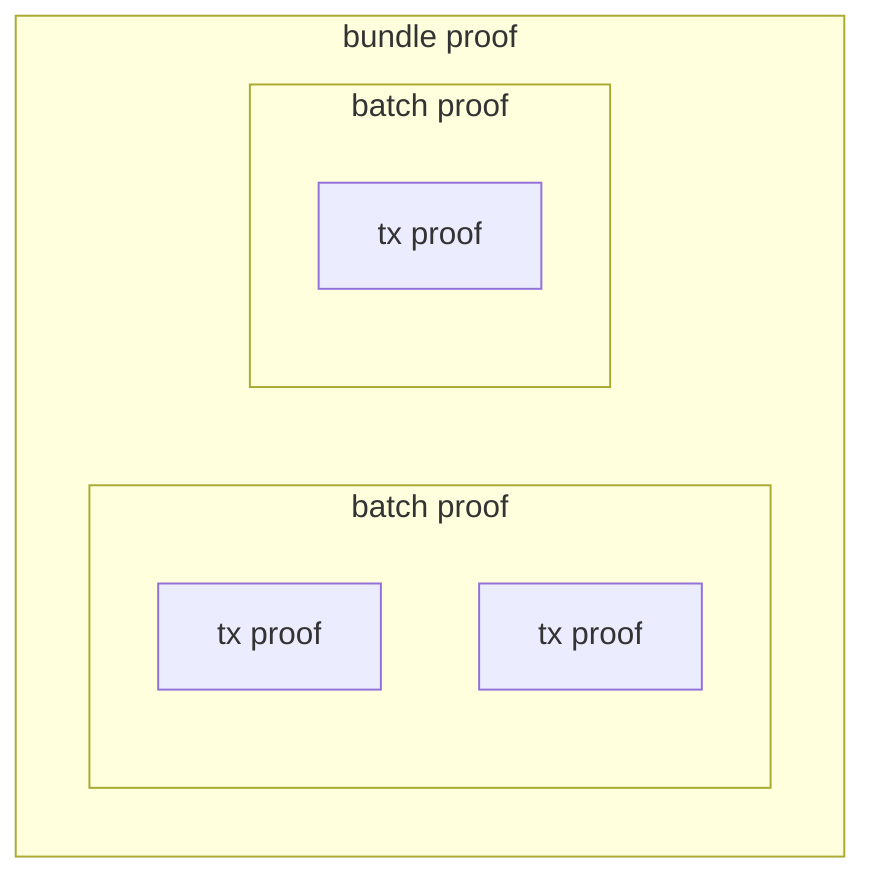
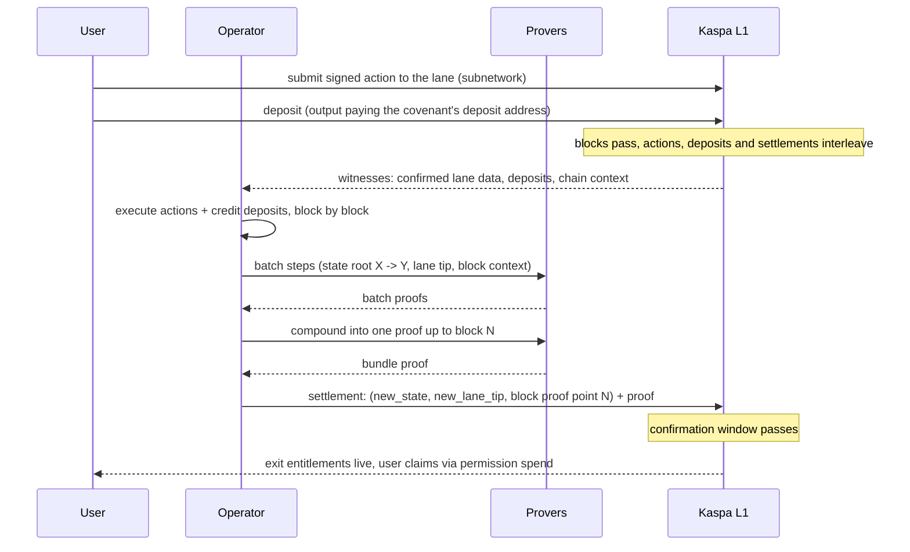

# How it all chains

This chapter puts the pieces together: every piece from the last
chapter (the lane, deposits, exits, user actions, settlements) moves
at once, across multiple L1 blocks, tied together by
proofs.

Vocabulary check before it piles up; six terms, one pipeline:

- a *witness* is confirmed L1 data fed to execution;
- a *tx proof* proves one transaction's execution; transactions that
  write disjoint resources execute and prove in parallel, across
  blocks too, while actions inside one transaction always run in
  sequence and contending transactions take the chain's order;
- a *batch* is the work over one block, and its proof is a *batch
  proof*;
- runs of batches compound into *aggregate* proofs;
- the latest aggregate, the one a settlement carries, is the *bundle
  proof*;
- the guest program that does the compounding is the *aggregator*
  ([The zkVM, briefly](zkvm.md)).

One word in that list needs more room. An *aggregate* is any such
compaction; a *bundle* is one built as a settlement candidate against
a specific view of the chain. A reorg can invalidate a bundle before
it settles (the [settlement appendix](appendix-settlements.md#what-if-cited-blocks-reorganize) has the recovery); the one that
settles is the bundle whose view survived, and its proof is the
bundle proof the settlement carries.

The wrappings, innermost out: one proof per transaction, compounded
into one proof per block, compounded into the one proof the settlement
carries.

The word *block* needs pinning too. Execution does not deal with the
blockdag's parallel web; it consumes one sequence of blocks, the order
consensus has already produced, and one block there is one step of
execution: one witness set, one batch. How the dag collapses into that
sequence, and what exactly counts as one block, is
[appendix](appendix-settlements.md#what-counts-as-one-block) material.

## State digests succeed each other

The program's history, the full ordered record of everything the L2
did, is a sequence of state transitions, one per executed block. The
machine writes them to its *journal*: every executed block produces
[one entry of this form](https://github.com/kaspanet/vprogs/blob/055ae28a/zk/abi/src/batch_processor/journal/batch_transition.rs#L10-L31), *previous state root, new state root, previous
lane tip, new lane tip, and the L1 context it saw*. The lane entries a
step consumed are the run between its two lane tips, every published
action up to the new one; where the step credited deposits or emitted
exits, their commitments ride the same entry (the deposit commitment
is the deposit address the step credited, hashed, a constant under
tt's shared address but the carrier of real information under a
per-user address policy; the exit commitment
is the permission tree's). A batch proof attests one such step; an
aggregate proof compounds a run of them.

L1 never sees the journal directly, and does not need to: the journal
is the proof's claim, one of the inputs zk verification checks the
receipt against, and the settlement script pins its on-chain numbers to the
journal digest the receipt commits ([The zkVM, briefly](zkvm.md#the-journal-what-the-proof-claims)
has the role it plays). What lands on L1 is one settlement
per proved window, and a window spans a range of blocks: the
settlement commits the final state digest of the range, the lane tip
execution had read to, the block proof point, and, where the window
emitted exits, the permission-tree commitment, all backed by the one
proof that covers the whole range of blocks ([The transaction vocabulary](transactions.md) lists what each
settlement carries). From the L1's point of view, then, the program's
history is a chain of 32-byte state roots, one per settlement, and
every step inside a window is provably reachable from the one before.

## Why multiple L1 blocks?

A match takes minutes: moves arrive, deposits confirm, other users act,
and the L1 keeps producing blocks the whole time. A proof covering a
single block would be stale before it landed. Instead, each proof
covers a *window* of
L1 history (all lane entries and deposits up to a named block), and the
settlement says so explicitly: this state is proven against L1 block N,
this lane tip is included, and if you disagree, verify the proof. User
actions submitted in block 3 and block 40 end up proven together into one
settled state, with nothing in between silently dropped: the node's
lane commitments ([KIP-21](https://github.com/kaspanet/kips/blob/master/kip-0021.md)) give the lane one canonical history, and
the proof binds its tip. Every block header carries a commitment to
every active lane: one root over the tips of all active lanes, where
each lane's tip is a running hash folded over every entry the lane
has ever carried. The tip is therefore a commitment value, not a
bookmark: replay the lane's entries through the hash and you land on
it. That is what makes the check tight. The fold follows the chain's
own order, one selected-chain block (its absorbed mergeset included)
at a time, the same order execution consumes ([the settlement appendix](appendix-settlements.md#what-counts-as-one-block)
defines one block). A batch guest consumes a run
of entries and journals the two tips it moved between, so its claim
is hash-bound to exactly those entries, and the settlement script
requires the proof's journal to commit the tip value the cited
block's header actually carries: the script derives this lane's
committed value from the journal's lane tip and compares it with
what the KIP-21 opcode serves for the cited block. Fabricate or skip one lane entry and
the recomputed tip no longer matches the header, so a proof about a
fabricated or stale L1 history cannot satisfy a node that follows the
real chain (the
[settlement appendix](appendix-settlements.md#can-a-range-be-skipped) has the mechanics, including why no range can be skipped).

The machine only cites blocks already behind the confirmation window,
so a cited block always sits deeper than the settlement resting on it.
A reorg deep enough to remove the cited block would also remove the
settlement, and past that depth both are as permanent as any Kaspa
payment. The commitment-reading opcode does enforce one bound of its
own: it serves commitments only from a recent window of blocks,
roughly the last twelve hours' worth. The header check reads one
block: the block proof point the settlement names
([The transaction vocabulary](transactions.md) defines it). Where the
proving window started needs no header of its own; the previous
settlement already pinned it. A machine
stalled longer than that must first prove a window that reaches a recent
block, then settle; the chaining shape makes that possible (the [settlement appendix](appendix-settlements.md#the-anchor-window-and-the-long-stall)
covers the recovery).

## Deposits and exits use the same proof path

Deposits are L1 outputs, so they're witnessed the same way lane actions
are, and bound twice: the proof's journal commits the deposit address it
credited, and the settlement script re-derives that address from the
covenant id and requires the proof to name exactly it. Exits flow the
other way through the same path: when execution debits a user and emits an
exit, the entitlement lands in the permission tree, and the settlement
carries the tree's commitment. One proof cycle carries the whole ledger
of who-entered and who-may-leave.

## Waiting for finality, and surviving reorgs

Kaspa orders blocks fast (roughly one per second), but "a block" is not yet "a fact". The machine
follows the chain behind a confirmation window, a configurable number of
confirmations, widened adaptively when the network looks reorg-prone, and
treats a block as solid only inside it. If the chain reorganizes anyway,
blocks the machine was watching simply vanish from its view as rollbacks:
bundles that stood on the reorganized side are dropped and rebuilt
against the surviving chain, and a settlement removed by a reorg before
it is confirmed is simply resubmitted (the [settlement appendix](appendix-settlements.md#what-if-cited-blocks-reorganize) has the recovery
detail, including which proving work gets reused). The settlement chain, immutable
once Kaspa has it, is never reinterpreted.

Money that already moved follows Kaspa's own rule. An exit claim is an
ordinary Kaspa transaction; once it is buried as deep as any ordinary Kaspa
payment requires, undoing it means rewriting Kaspa, not rewriting the rollup.
The machine protects *state*; Kaspa's proof-of-work depth protects
*payments*, payouts included.

## Reading one settlement

Look at a single settlement tx on an explorer. It names
its covenant id. It commits the new state digest, the lane tip, and the block
it proves to. Its first output can only be spent by the next settlement of
the same covenant id, so the history cannot fork without splitting real
money on L1. Where the bundle emitted exits, a permission output commits
the tree: live, claimable entitlements (a bundle with no exits settles
without one). And everything inside it, every move of every game,
every deposit, every balance, is a 32-byte root away, verified by a proof
anyone can check. What L1 does *not* enforce is freshness: nothing on-chain
forces a settlement to advance the tip to today's lane head; the tip moves
when the operator settles, and an operator can stall ([The machinery](machinery.md) lists
the stall cases). The rest of this book covers who runs the machine, what
proves it, and what building on it is like.
