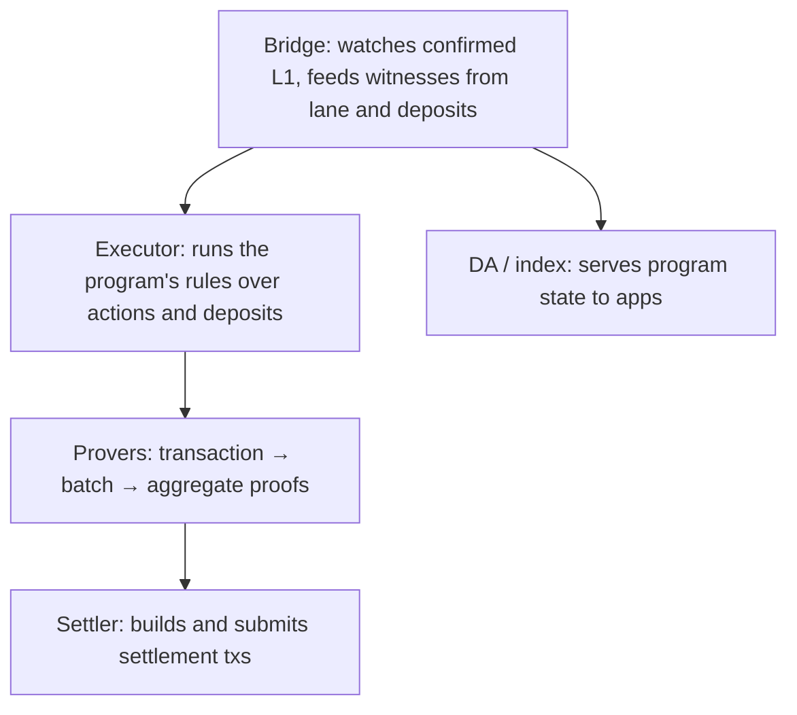

# The machinery

Chapter 4 followed one settlement through time. This chapter stands still
and looks around: who runs what. Four roles cover the whole machine.

**The bridge** is the machine's eyes on L1. It follows the Kaspa chain
behind the confirmation window and turns confirmed lane actions and
deposits into the inputs execution consumes. Users submit to the lane
themselves; the bridge only ever reads. Every fact the machine believes
about L1 arrives through it.

**The executor** applies the program's rules, the guest code, to the
witnessed actions. It is deliberately boring: same inputs, same state, same
result. Everything interesting about *what* it computes belongs to the
program, not the executor.

**The provers** turn execution into arithmetic certainty, in three stages,
one guest program each: the transaction guest proves one transaction, the
batch guest compounds a block of those proofs, and the aggregator
compounds batches into the single proof a settlement carries. Batch
proofs chain within a bundle, and bundles chain across settlements, so
the pipeline is a chain by construction. Staging exists for the same reason factories have stations:
each stage stays small enough to run continuously, and the final product
is one compact proof covering everything.

**The settler** builds the settlement transaction (state digest, lane tip,
proof, continuation and permission outputs) and submits it to Kaspa.

**The DA/index layer** is the read side: an operator can serve the
program's current state over an API so apps can query it without replaying
proofs. Chapter 8 builds on it.

In tt's deployment these roles are in-process components of the single
`ttd` daemon (the framework's reusable runner engine), plus the web app
reading the DA APIs. The roles are independent of the packaging, though:
a bigger deployment could scale each separately.

## Who are you trusting, again?

With the roles named, the trust question from chapter 2 gets concrete.
The bridge can't invent L1 facts; the proofs check everything against
the real chain. The executor can't cheat; its output is proven. The
settler can't settle fiction; Kaspa verifies the proof before accepting
the tx, and the settlement chain can't fork without splitting real money.
What the operator *can* do is stop: stop executing, stop proving, stop
settling, or quietly stall, forever settling against an old lane tip so
your action is never included. That is the liveness trust, stated without
decoration: **safety needs no operator; movement does, until someone else
takes over.**

Two things make "someone else" possible rather than magical. First,
nothing in the machine is operator-keyed: the settlement script checks
proofs and ends without any signature (a valid proof from anyone extends
the chain), the bridge only reads public chain data, and the lane is
public. So anyone can, in principle, stand up this same open stack
against the same lane and continue where the last operator stopped.
Second, exits already committed to the permission tree are claimable by
their holders alone; no operator sits in that loop. Permissionless
settlement cuts both ways, though. A griefer with a proving stack can
settle empty extensions: bundles that execute nothing new and leave the
lane tip behind its true head, so pending actions (yours, perhaps) stay
unsettleable. Both sides spend the same continuation output, so each link
is a mempool race; whoever confirms first wins, the loser's settlement
dies with its input, and its proving work is wasted. Nothing on-chain
punishes any of this; the only brake is cost, paid by the griefer, for
every round they win, for as long as they keep winning. What they cannot
touch is safety: state stays unforgeable and committed exits stay
claimable. What stalls is movement. Permissionless is a floor under
liveness, not a ceiling on nuisance. What is *not* shipped today is an escape hatch, a flow that lets
a user force a settlement through without first running the machine. Until
one exists, a balance that never became a committed exit waits for an
operator, and the honest sentence is: exit early if you plan to leave.
