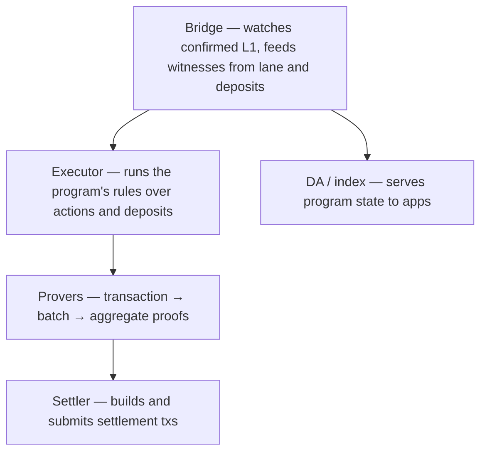

# The machinery

Chapter 4 followed one settlement through time. This chapter stands still
and looks around: who runs what. Four roles cover the whole machine.

**The bridge** is the machine's eyes on L1. It follows the Kaspa chain
behind the confirmation window and turns confirmed lane actions and
deposits into witnesses for execution — users submit to the lane
themselves; the bridge only ever reads. Every fact the machine believes
about L1 arrives through it.

**The executor** applies the program's rules — the guest code — to the
witnessed actions. It is deliberately boring: same inputs, same state, same
result. Everything interesting about *what* it computes belongs to the
program, not the executor.

**The provers** turn execution into arithmetic certainty, in three stages:
a proof per transaction, compounded into a proof per batch, compounded
again into the single proof a settlement carries. Staging exists for the
same reason factories have stations — each stage stays small enough to run
continuously, and the final product is one compact proof covering
everything.

**The settler** builds the settlement transaction — state digest, lane tip,
proof, continuation and permission outputs — and submits it to Kaspa.

**The DA/index layer** is the read side: an operator can serve the
program's current state over an API so apps can query it without replaying
proofs. Chapter 8 builds on it.

In tt's deployment these roles are in-process components of the single
`ttd` daemon — the framework's reusable runner engine — plus the web app
reading the DA APIs. The roles are independent of the packaging, though:
a bigger deployment could scale each separately.

## Who are you trusting, again?

With the roles named, the trust question from chapter 2 gets concrete.
The bridge can't invent L1 facts — the proofs check everything against
the real chain. The executor can't cheat — its output is proven. The
settler can't settle fiction — Kaspa verifies the proof before accepting
the tx, and the settlement chain can't fork without splitting real money.
What the operator *can* do is stop: refuse to sequence, refuse to settle,
disappear. That is the liveness trust, and it is answered by design
rather than by honesty — user funds are exit-able through the permission
tree, and nothing in the machine requires believing the operator will be
there tomorrow. Run your own bridge and verifier if you want; the proofs
don't care who checked them.
