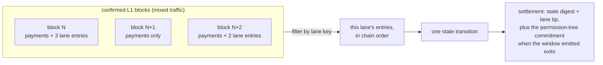
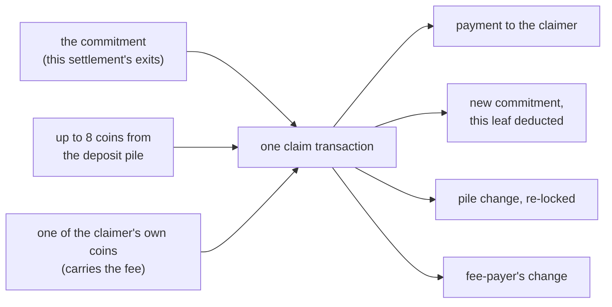

# The transaction vocabulary

Before this machine can have a transaction vocabulary, it needs the plain
one: what a Kaspa transaction is. Then the compression trick that lets a
whole off-chain world ride inside one. Only then the four transaction
types the machine is built from, which is where the L2, the program's own
world, actually appears.

## The Kaspa transaction itself

Every Kaspa transaction, whether it pays a friend or runs this machine,
has the same anatomy. It consumes earlier outputs (its *inputs*) and
creates new ones (its *outputs*). An output is an amount of KAS plus a
lock: the *SPK*, a small program stored inside the output. A later
transaction spends that output by supplying input data that satisfies its
lock, and once spent, the output is gone; no other transaction can
reference it again. That is the whole format. The books balance: a
transaction's inputs must be worth at least its outputs, and the
difference is the fee, paid to whoever mines the block that includes it.
Paying 3 KAS out of a single 10 KAS output means building two outputs in
the same transaction: 3 to the recipient, the rest back to your own lock,
your change. Every transaction in this book, payment or machine, plays by
those rules. There are no accounts and
no shared stored state on this chain, only coins at locks, each spendable
exactly once, and whatever anyone builds on Kaspa is expressed in these
bytes. The one-shot rule is the first wall from the last chapter; here it
is just the raw material.

The shape itself, annotated:

```text
a Kaspa transaction
├── inputs: earlier outputs being spent, each named by its
│   transaction id and position, each carrying the unlock data
│   its SPK demands
├── outputs: new coins, each an amount in sompi plus the SPK
│   (the lock) they now sit at
├── version and lock time: housekeeping, ignorable in this book
└── subnetwork id and payload: a label and a data field; plain
    payments leave them default, and the machine's lane tag
    rides them (the lane section below)
```

Everything the machine publishes, deposits included, is built from this
one shape.

## State compression: a world in 32 bytes

The program in this book keeps accounts, games and balances, and none of
that fits inside one-shot outputs. So the full state lives off-chain, and
what the chain holds is a fingerprint of it: the **state digest**, a
single 32-byte root of a *sparse Merkle tree* (a tree of hashes: every
node is the fingerprint of its children, all the way up to one root).
The tree is the whole state hashed into a structure where every possible
position exists. "Sparse" means the empty positions are not stored
anywhere: the tree is a rule for computing what an empty spot would hash
to, so where a thing sits never depends on what else is present. That is
what makes membership cheap: proving that one account was inside takes a
short branch of hashes and reveals nothing else. Change one sompi (the
smallest unit of KAS) anywhere and the digest is a completely different
number; there is no way to move the state without moving the
fingerprint. One chain-held number commits to an entire off-chain world,
and that is the load-bearing trick of this whole book: the chain never
stores the world, it checks fingerprints of it. Digest, root, state
root: this book uses the words interchangeably for the same 32 bytes.

## The four transactions

Those two pieces are what the L1 offers: a transaction format that can
carry anything, and a way to compress a world into a number a
transaction can carry. The L2 is what you build with them: the program
executes off-chain, over the full state, and publishes the compressed
digest, using ordinary Kaspa
transactions for everything that must be trusted, carrying users' intent
in, ordering it, committing state back, paying value out. Kaspa sees
four kinds of transaction from this machine, and from the L1's side they
all have exactly the same shape: same fields, same validation, nothing
marked out in protocol. The split into four is not an L1 distinction at
all; it is semantics from the L2, the program's perspective: particular
scripts and payloads whose meaning only the proofs enforce.

- a **settlement** spends the output only a valid settlement can spend,
  and commits the new state digest
- a **lane entry** is an ordinary transaction tagged for the program's
  subnetwork, carrying a signed action
- a **deposit** is an ordinary payment to the program's deposit address
- an **exit claim** spends the program's payout commitment and pays a
  user out

Two are plain Kaspa usage (lane entries, deposits); two are the machine's
own script shapes (settlements, claims). Learn the four and every chapter
after this is just consequences. The rest of this chapter walks both
views: what lands on Kaspa, then what the program makes of it.

## The state transition (settlement)

The settlement is the tx that matters: it is the only thing that advances the
program's authoritative state, and it does so on Kaspa itself. A settlement
attests three things at once:

- a **state digest**: the program's new state root, the 32-byte
  fingerprint from the compression section above. The full state (every
  account, every game, every balance) lives off-chain, served by the
  operator's index: a convenience, not a gatekeeper, because the lane and
  chain carry everything needed to rebuild it (chapter 9). What Kaspa
  holds is the fingerprint of all of it at one
  moment. The proof's central claim is always of the form "state root X
  became state root Y by executing the rules correctly".
- a **lane tip**: how far execution had read the program's action lane
  (next section) when the snapshot was taken: "I have processed every
  published action up to here."
- a **block proof point**: the last L1 block whose data execution
  consumed: "and the L1 world I saw was real up to this block."

Read a settlement as a snapshot claim, not a switch. It says: at block Y,
the state digest was D. The proof inside shows how the digest got there,
root by root, from block X to block Y, where X is the previous
settlement's proof point; the windows are contiguous, each proof's
journal continuing exactly where the last one ended, so no block range
goes unwitnessed. The settlement transaction itself
lands at least one block after Y, and sometimes later: the gap is proving
time plus the confirmation window the cited blocks must pass, before the
settlement is even submitted. Each settlement
pins one more provable snapshot; nothing starts applying "from now on".

These three ride directly in the settlement transaction's script data
(the bytes its inputs carry to satisfy the covenant's lock), and
the settlement's outputs chain to the next settlement: output 0 is a P2SH
continuation that only the *next* valid settlement can spend. So on L1
itself there grows a single unbroken chain of settlements, each one
inheriting its predecessor's covenant and committing the next state digest.
That chain *is* the program's history; you can walk it on any Kaspa
explorer.

## The lane (subnetwork) and its key

User actions can't just be whispered to the operator, because then nobody
could prove what was submitted, when, or in what order. Instead, each
program instance owns a **lane**: an L1 subnetwork where its users' actions
are published as ordinary Kaspa transactions. The entries are ordered by
the node's own commitment machinery (KIP-21): no sequencer decides, the
chain's own order is the order, and Kaspa's consensus can prove, up to
any block, exactly what it
contained. So the lane has a single
well-defined head, the **lane tip**, and the L1 node itself can prove what
the lane contained up to any block.

What is a lane, physically? Ordinary Kaspa transactions. A lane entry is a
real transaction, paying a real Kaspa fee from the user's own funds, mined
by the network's miners like any payment. The subnetwork is a label the
node's consensus tracks: it gossips, orders, and accounts for lane traffic
alongside ordinary payments, and carrying registered lanes is a consensus
rule with its own per-lane capacity limit, not an opt-in a miner could
quietly refuse. And (this is the load-bearing part) the node
itself will hand anyone a cryptographic proof of what the lane contained up
to any confirmed block. There is no lane operator to refuse an entry;
entry happens through the Kaspa mempool, the network's shared waiting
room for transactions not yet in blocks.

The lane is the program's front door and its data availability in one:
publish there and the operator *must* eventually see your action; prove
from there and a verifier *knows* nothing was left out. The lane is
identified by a **lane key**, the hash of its subnetwork id, and every
proof names the lane it settles.

How the lane becomes state, in one picture: execution watches confirmed
blocks, filters each one down to this lane's entries, and wraps a whole
run of them, several blocks' worth, into a single proved transition;
where that run emitted exits, the settlement carries the
permission-tree commitment alongside.



## User action txs

Everything a user does inside the program is a signed action: in tt that's
transferring balance, rotating your lock (switching the key that
authorizes your account, the move you want if a key leaks), depositing,
withdrawing, creating
a game, joining a game, placing a mark, forfeiting an expired turn. The
program runs against the L1's own per-block context, block timestamps,
DAA score, blue score, committed by the chain and carried inside every
proof window (KIP-21 commits them for exactly this use), so "expired"
is a chain fact, not the operator's watch.
An action carries its author's authorization (more on locks and signers
below) and is published to the lane. What makes an action *valid* (whose
signature, which state it may touch, how much stake a game locks, what
happens when your turn timer expires) is not L1 law. It is the program's
own logic, checked inside the proof. The L1 neither knows nor cares what a
"game" is; it only carries the action to the machine that does.

## Deposits

A deposit is how value enters: an ordinary L1 output, paid to the program's
**deposit address** (derived from the *covenant id*, the 32-byte identity
of this program instance from the glossary; this chapter pins it properly
at the end),
and credited to a user by the program's rules. In tt the deposit
*is* the action: the Kaspa transaction you publish to the lane carries your
signed deposit action (naming the account to credit, and your lock if the
account is new) and, in the same transaction, an output paying the deposit
address. The proof checks that the output exists, pays the covenant-derived
script, and credits exactly the account your signature named. Nobody can
steer your deposit to a different account, and the landed coins sit at a
script that only proven exits can unlock, never at an operator's key.

The shape is fixed (an L1 output, recognized by the program, proven into
the state), but the *address policy* is the guest's choice (the *guest* is
the program's own code running inside the zkVM; chapter 7). tt's deposit
policy derives one shared deposit address from the covenant; the framework
documents a per-user address scheme as an
equally valid choice. Same battery, different placement.

## Exits and the permission tree

An exit is how value leaves: the program debits a user and emits an
entitlement to withdraw on L1. The entitlements land in the
**permission tree**, an accumulator (a Merkle structure that answers one
question: is this leaf in?) whose leaves are
"(L1 script, amount)" pairs: who may claim how much, by L1 lock type.
A settlement that emitted exits carries a commitment to exactly those
exits, the ones its own proof window produced, in a dedicated P2SH
output (a settlement with no new exits carries none). Each commitment
covers only its own settlement's exits, so an entitlement lives in
exactly one commitment, ever.

A user claims by spending that commitment on L1, and the claim works
like making change. Your claim transaction pulls in the commitment
itself, up to eight whole coins from the program's deposit pile (only
this script shape can unlock them; your wallet picks which), and one
ordinary coin of your own to carry the fee. The script checks on-chain
that what was pulled from the pile covers your amount. Then the outputs:
your leaf's value paid to you, the pile's untouched change re-locked at
the same script for the people still in line, a fresh commitment with
your leaf deducted for the next claimant, and the unspent part of your
fee coin back to you. The commitment is a self-updating UTXO: each claim
spends it and hands the next claimant a tree with one less leaf.



The same exit cannot be claimed twice over, and the reasons are
structural: your leaf exists in one commitment only, the UTXO you spent
is gone, and the new commitment no longer contains your leaf. Claims
against the same commitment queue behind each other, exactly like any two
spends of one coin: heavy exit traffic lines up, and two claims racing in
the mempool conflict like any double-spend. One wins; the other's
transaction can no longer confirm (its input is gone), and the wallet
rebuilds it against the new commitment once it sees the winner. Claims
against different settlements' commitments are independent transactions
and pay out in parallel. The machine watches landed claims for its own
books (the exit list an app reads), not as a second line of defense. A
malformed claim fails its own validation; it cannot jam anyone behind
it. What does not ship is a sweeper for the pile itself: every claim
splits what it sweeps, the network's dust rules floor how small the
pieces can get, and keeping the pile in healthy coins is operational
work.

Like the deposit policy, the permission tree is a ready-made part: the
framework ships the accumulator, the L1 commitment format, and the claim
flow. A program with different needs could, in principle, ship its own exit
design; the settlement shape would not change.

## Shape versus rules

| Fixed by the rollup shape | Chosen by the program (batteries included) |
|---|---|
| Actions are signed and published to a lane | What the actions *are* (tt: `CreateGame`, `PlaceMark`, …) |
| State is a digest; settlements chain digests on L1 | What lives in the state (resources, balances, boards) |
| Value enters by L1 deposit, leaves by proven exit | The deposit address policy |
| Settlements prove execution against L1 blocks | The exit mechanism (permission tree is the standard part) |
|  | Locks, unlockers, signers: how users authorize |

That last row deserves its own sentence: **locks, unlockers, and signers are
guest preferences too**. The framework provides common implementations: a
lock names who may act (tt uses pubkey locks), a signer proves control of
it, an unlocker pairs them. A program can compose or replace them.
Every battery above is real, shipped code in vprogs today; "replaceable"
means the *shape* doesn't depend on which one you use.

One term is left, and it names the whole thing: a **covenant id**: the
32-byte identity of one program instance. Deposits pay into it, settlements
chain within it, exits reference it, and at bootstrap it is pinned together
with the exact guest program binaries, by their cryptographic image ids
(chapter 7); the covenant id is "this
program, these exact rules, this instance". The pinned rule-set is public
on-chain: the covenant's script hash is computed *from* the pinned image
ids, so anyone can take a claimed rule-set, recompute the hash, and check
it against the address before depositing. The covenant id itself is
derived from that same script at bootstrap, so id, address, and rules
are one package: change the rules and every name changes with them.

Settlements are pinned twice over, and the full list is short: the
covenant id fixes the instance, and the image ids fix the exact code
and proof stack it runs. The image-id pin is the load-bearing one: a
guest that changes by one byte no longer matches it, which is why an
upgrade is an emigration (chapter 8). That pin is a choice, not a law
of nature; the pin could in principle migrate to new images,
but no such mechanism ships today. The tooling for that check is a
script, not a website, today. For a reader who will never run a script,
the honest version: the check is public and repeatable by anyone, so in
practice you rely on someone you trust having run it, which is the same
trust in the code that chapter 3's table already counted. In tt's live deployment the covenant id is
literally a constant. It is the settlement
chain's first link: at bootstrap the operator funds an initial output
locked by the covenant's script at its genesis state, and every
settlement descends from it.

With the vocabulary in hand: how do proofs tie all four tx types together
across multiple L1 blocks?
