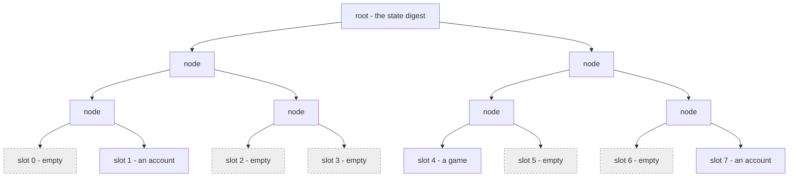
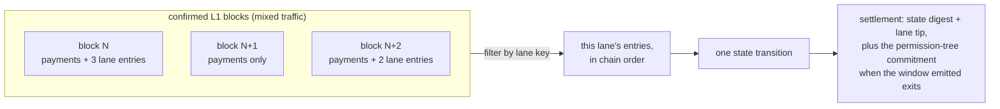

# The transaction vocabulary

This chapter first covers what a Kaspa transaction is, then the
compression step that fits the off-chain state into 32 bytes, and then
the four transaction types the machine is built from, which is where the
L2, the program's own world, appears.

## The Kaspa transaction itself

Every Kaspa transaction, whether it pays a friend or runs this machine,
has the same anatomy. It consumes earlier outputs (its *inputs*) and
creates new ones (its *outputs*). An output is an amount of KAS plus a
lock: the *SPK*, a small program stored inside the output. A later
transaction spends that output by supplying input data that satisfies its
lock, and once spent, the output is gone; no other transaction can
reference it again. That is the whole format. The books balance: a
transaction's inputs must be worth at least its outputs, and the
difference is the fee, paid to whoever mines the block that includes it.
Paying 3 KAS out of a single 10 KAS output means building two outputs in
the same transaction: 3 to the recipient, the rest back to your own lock,
your change. Every transaction in this book, payment or machine, plays by
those rules. There are no accounts and
no shared stored state on this chain, only coins at locks, each spendable
exactly once, and whatever anyone builds on Kaspa is expressed in these
bytes. The spend-once rule is the first limit from chapter 3; this chapter
builds directly on it.

The shape itself, annotated:

```text
a Kaspa transaction
├── inputs: earlier outputs being spent, each named by its
│   transaction id and position, each carrying the unlock data
│   its SPK demands
├── outputs: new coins, each an amount in sompi plus the SPK
│   (the lock) they now sit at
├── version and lock time: housekeeping, ignorable in this book
└── subnetwork id and payload: a label and a data field; plain
    payments leave them default, and the machine's lane tag
    rides them (the lane section below)
```

Everything the machine publishes, deposits included, is built from this
one shape.

## State compression: a world in 32 bytes

The program in this book keeps accounts, games and balances, and none of
that fits inside one-shot outputs. So the full state lives off-chain, and
what the chain holds is a fingerprint of it: the **state digest**, a
single 32-byte root of a *sparse Merkle tree* (a tree of hashes: every
node is the fingerprint of its children, all the way up to one root).
The tree is the whole state hashed into a structure where every possible
position exists. "Sparse" means the empty positions are not stored
anywhere: the tree is a rule for computing what an empty spot would hash
to, so where a thing sits never depends on what else is present.

Eight leaf slots out of an unbounded sheet of them, each addressed by
position:



The empty slots are the "sparse" part done cheaply: an empty slot's hash
comes from the fixed rule, not from storage, and an entirely empty
subtree collapses to one computed value, so emptiness costs nothing.
That is what makes membership cheap: proving that one account was inside
takes a short branch of hashes and reveals nothing else. Change one sompi
(the smallest unit of KAS) anywhere and the digest is a completely
different number; there is no way to move the state without moving the
fingerprint. One chain-held number commits to the entire off-chain
state; that is the core mechanism of this book: the chain never stores
the state, it checks fingerprints of it. Digest, root, state
root: this book uses the words interchangeably for the same 32 bytes.
(This structure is standard equipment far beyond this book; [Kelvin
Fichter's "What's a Sparse Merkle Tree?"](https://medium.com/@kelvinfichter/whats-a-sparse-merkle-tree-acda70aeb837)
is the classic short introduction, with pictures in the same shape.)

## The four transactions

Those two pieces are what the L1 offers: a transaction format that can
carry anything, and a way to compress a world into a number a
transaction can carry. The L2 is what you build with them: the program
executes off-chain, over the full state, and publishes the digest.
Everything that must be trusted rides ordinary Kaspa transactions: they
carry users' intent in, order it, commit state back, and pay value out.
The machine
publishes four kinds of transaction, and from the L1's side, from
Kaspa's side, they all have exactly the same shape: same fields, same
validation, nothing marked out in protocol. The split into four is not
an L1 distinction at all; it is semantics from the L2, the program's
perspective: particular scripts and payloads whose meaning only the
proofs enforce.

- a **lane entry** is an ordinary transaction tagged for the program's
  subnetwork, carrying a signed action
- a **deposit** is an ordinary payment to the program's deposit address
- an **exit claim** spends one of the program's exit commitments and
  pays a user out
- a **settlement** spends the output only a valid settlement can spend,
  and commits the new state digest

Two are plain Kaspa usage (lane entries, deposits); two carry the
machine's own scripts (settlements, claims). The rest of the book
follows from these four. This chapter takes them in the order things
flow: the lane they ride, value in, value out, the actions between, and
the settlement that commits it all.

## The lane (subnetwork) and its key

User actions cannot be sent privately to the operator, because then nobody
could prove what was submitted, when, or in what order. Instead, each
program instance owns a **lane**: an L1 subnetwork where its users' actions
are published as ordinary Kaspa transactions. The entries are ordered by
the node's own commitment machinery ([KIP-21](https://github.com/kaspanet/kips/blob/master/kip-0021.md)): no sequencer decides, the
chain's own order is the order, and Kaspa's consensus can prove, up to
any block, exactly what it
contained. So the lane has a single
well-defined head, the **lane tip**, and the L1 node itself can prove what
the lane contained up to any block.

What is a lane, physically? Ordinary Kaspa transactions. A lane entry is a
real transaction, paying a real Kaspa fee from the user's own funds, mined
by the network's miners like any payment. The subnetwork is a label the
node's consensus tracks: it gossips, orders, and accounts for lane
traffic alongside ordinary payments. Carrying registered lanes is a
consensus rule, not an opt-in a miner could quietly refuse. Each lane
has a per-block capacity limit; entries over the limit wait for later
blocks, and nothing is dropped or refused. And the node
itself will hand anyone a cryptographic proof of what the lane contained up
to any confirmed block. There is no lane operator to refuse an entry;
entry happens through the Kaspa mempool, the network's shared waiting
room for transactions not yet in blocks.

The lane is both the program's entry point and its data availability:
publish there and the operator must eventually see your action; prove
from there and a verifier knows nothing was left out. The lane is
identified by a **lane key**, the hash of its subnetwork id, and every
proof names the lane it settles.

How the lane becomes state, in one picture: execution watches confirmed
blocks, filters each one down to this lane's entries, and wraps a whole
run of them, several blocks' worth, into a single proved transition;
where that run emitted exits, the settlement carries the
permission-tree commitment alongside.



## Deposits

A deposit is how value enters: an ordinary L1 output, paid to the program's
**deposit address** (derived from the *covenant id*, the 32-byte identity
of this program instance from the glossary; this chapter pins it properly
at the end),
and credited to a user by the program's rules. In tt the deposit
*is* the action: the Kaspa transaction you publish to the lane carries your
signed deposit action (naming the account to credit, and your lock if the
account is new) and, in the same transaction, an output paying the deposit
address. The proof checks that the output exists, pays the covenant-derived
script, and credits exactly the account your signature named. Nobody can
steer your deposit to a different account, and the landed coins sit at a
script that only proven exits can unlock, never at an operator's key.

The shape is fixed (an L1 output, recognized by the program, proven into
the state), but the *address policy* is the guest's choice (the *guest* is
the program's own code running inside the zkVM; chapter 7). tt's deposit
policy derives one shared deposit address from the covenant id; the framework
documents a per-user address scheme as an
equally valid choice. Same battery, different placement.

## Exits and the permission tree

An exit is how value leaves: the program debits a user and emits an
entitlement to withdraw on L1. The entitlements land in the
**permission tree**, an accumulator (a Merkle structure that answers one
question: is this leaf in?) whose leaves are
"(L1 script, amount)" pairs: who may claim how much, by L1 lock type.
A settlement that emitted exits carries a commitment to exactly those
exits, the ones its own proof window produced, in a dedicated P2SH
output (a settlement with no new exits carries none). Each commitment
covers only its own settlement's exits, so an entitlement lives in
exactly one commitment, ever.

A user claims with one ordinary Kaspa transaction that spends that
commitment. The claim's unlock data reveals the leaf and its branch in
the tree; the script checks the branch against the committed root, takes
the amount and the destination lock from the leaf, and requires the
payment to match both. The payout is funded from the program's deposit
pile; the untouched remainder is re-locked at the same script. A fresh
commitment with this leaf deducted serves the next claimant. So the same
exit can never be paid twice: the leaf lives in one commitment, the UTXO
spent is gone, and the new commitment no longer contains it. Claims on
one commitment queue like any two spends of one coin; claims on
different commitments pay out in parallel. What does not ship is a
sweeper for the pile itself: claims split what they sweep and dust rules
floor the pieces, so keeping the pile in healthy coins is operational
work.

The claim transaction's full anatomy (which coins it pulls, how the fee
rides, what each output is) and what happens when two claims race are
[appendix](appendix-settlements.md) material.

Like the deposit policy, the permission tree is a ready-made part: the
framework ships the accumulator, the L1 commitment format, and the claim
flow. A program with different needs could, in principle, ship its own exit
design; the settlement shape would not change.

## User actions

Everything a user does inside the program is a signed action: in tt that's
transferring balance, rotating your lock (switching the key that
authorizes your account, the move you want if a key leaks), depositing,
withdrawing, creating
a game, joining a game, placing a mark, forfeiting an expired turn. The
program sees the chain's own time and depth counters (timestamp, DAA
score, blue score), committed by the chain inside every proof window
(KIP-21 commits them for exactly this use), so "expired" is determined
by the chain, not by the operator.
An action carries its author's authorization (more on locks and signers
below) and is published to the lane. What makes an action *valid* (whose
signature, which state it may touch, how much stake a game locks, what
happens when your turn timer expires) is not L1 law. It is the program's
own logic, checked inside the proof. The L1 does not know what a
"game" is; it carries the action to the program, which does.

## The settlement

The settlement is the committing transaction: the only one that advances
the program's authoritative state, and it does so on Kaspa itself. A
settlement attests three things at once:

- a **state digest**: the program's new state root, the 32-byte
  fingerprint from the compression section above. The full state (every
  account, every game, every balance) lives off-chain; the lane and the
  chain carry everything needed to rebuild it (chapter 9). What Kaspa
  holds is the fingerprint of all of it at one
  moment.
- a **lane tip**: how far execution had read the program's action lane
  (the lane section above) when the snapshot was taken: "I have processed every
  published action up to here."
- a **block proof point**: the last L1 block whose data execution
  consumed: "and the L1 world I saw was real up to this block."

Each attestation is backed by a **zk proof**, carried in the same
transaction. The proof's central claim is always of the form "state
root X became state root Y by executing the rules correctly": the
previous settlement's digest, the claimed new digest, and every lane
entry, deposit, and L1 context item in between, processed by the
program's pinned code, with nothing skipped and nothing invented. The
proof is generated off-chain by a zkVM and verified on-chain by every
Kaspa node as a consensus rule (KIP-16; chapter 7 covers the zkVM). A
settlement whose proof does not verify is invalid, and no node includes
it.

These three ride directly in the settlement transaction's script data
(the bytes its inputs carry to satisfy the covenant's lock), and
the settlement's outputs chain to the next settlement: output 0 is a P2SH
continuation that only the *next* valid settlement can spend. So on L1
itself there grows a single unbroken chain of settlements, each one
inheriting its predecessor's covenant id and committing the next state digest.
That chain *is* the program's history; you can walk it on any Kaspa
explorer.

How the windows behind one settlement chain together, why no block range
can be skipped, and what happens when cited blocks reorganize are
mechanics worth their own page: the [appendix](appendix-settlements.md)
has them.

## Shape versus rules

| Fixed by the rollup shape | Chosen by the program (batteries included) |
|---|---|
| Actions are signed and published to a lane | What the actions *are* (tt: `CreateGame`, `PlaceMark`, …) |
| State is a digest; settlements chain digests on L1 | What lives in the state (resources, balances, boards) |
| Value enters by L1 deposit, leaves by proven exit | The deposit address policy |
| Settlements prove execution against L1 blocks | The exit mechanism (permission tree is the standard part) |
| Actions require authorization | Locks, unlockers, signers: how users authorize |

That last row deserves its own sentence: **locks, unlockers, and signers are
guest preferences too**. The framework provides common implementations: a
lock names who may act (tt uses pubkey locks), a signer proves control of
it, an unlocker pairs them. A program can compose or replace them.
Every battery above is real, shipped code in vprogs today; "replaceable"
means the *shape* doesn't depend on which one you use.

One term is left, and it names the whole thing: a **covenant id**, the
32-byte identity of one program instance. Deposits pay into it,
settlements chain within it, exits reference it. And the full list of
what a settlement chain is pinned to is short: the covenant id fixes the
instance, and the image ids of the exact guest binaries (chapter 7) fix
the code and proof stack it runs. The pins chain together: the
covenant's script hash is computed from the pinned image ids, and both
the deposit address and the covenant id derive from that script, so
rules, id, and address change together. Anyone can recompute the hash
and check the address before depositing; the tooling is a script today,
not a website, so in practice you rely on someone you trust having run
it, the same trust in the code that chapter 3's table already counted.
An image id that changes by one byte no longer matches its pin, which is
why an upgrade means moving to a new instance (chapter 8); the pin could in principle
migrate to new images, but no such mechanism ships today.

In tt's live deployment the covenant id is literally a constant. It is
the settlement chain's first link: at bootstrap the operator funds an
initial output locked by the covenant's script at its genesis state, and
every settlement descends from it.

With the vocabulary in hand: how do proofs tie all four tx types together
across multiple L1 blocks?
