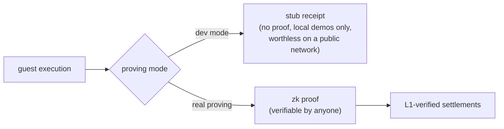

# The zkVM, briefly

The engine under everything is a **zero-knowledge virtual machine**, a
zkVM. This chapter is the minimum you need; the cryptography stays in its
box.

A zkVM runs an ordinary program (normal instructions, normal toolchain),
but alongside the result it produces a **receipt**: a small artifact that
proves "this exact program, on this exact input, produced this exact
output". Anyone can verify the receipt in milliseconds, without re-running
the program and without trusting whoever ran it. The magic, such as it is:
verification cost is nearly independent of execution cost. A program may
run for an hour; its receipt still checks in a blink. Think of it as a
notarized execution transcript, except the notary is mathematics, and the
transcript is a few kilobytes.

## What vprogs uses today

vprogs is built on **RISC0**, a zkVM for RISC-V programs. The proving
pipeline is three guest programs, each an ordinary program binary (in
RISC-V ELF form) with its own
*image id*:

- the **transaction guest** is the application itself: tt's runtime and
  rules, compiled with the framework's runtime processor. It executes one
  transaction's actions against state and produces the per-transaction
  proof.
- the **batch guest** verifies a block's transaction receipts and
  compounds them into one proof per batch.
- the **aggregator** compounds a run of batch proofs into the single proof
  a settlement carries: the bundle proof.

All three image ids are pinned into the covenant at bootstrap (chapter 4),
and every proof names the exact images it executed, so "the rules" are
never an ambiguous reference. One property of the pipeline matters for
everything downstream: bundles prove in sequence, each on top of the last,
because each bundle's journal continues the previous one. That is what
makes the digest chain a chain. It also shapes latency: because each
proof continues the last instead of restarting, a prover that keeps up
stays a fixed distance behind the chain; a prover that cannot keep up
falls behind without bound. While it is behind, settlements wait, so
exits wait to be committed: the same liveness exposure chapter 6 names.
Recovery is catching up, and the shape allows it: a proof window can span
many blocks, so a backlog drains in bigger bites at the price of later
snapshots, and a machine stalled past the twelve-hour anchor window of
chapter 5 must prove such a span before it can settle again.

And where does verification happen? On-chain, in consensus. Kaspa's script
engine ships a zk-verify opcode (KIP-16, live on testnet-10); the
settlement's script calls it with the receipt, and every Kaspa node
executing that transaction runs the check. A bad-proof settlement is not
a controversial settlement, it is an invalid one, rejected like a bad
signature. The verifier identity (which image ids, which proof system)
is baked into the covenant's script hash, so "which rules am I trusting?"
and "which address did I pay?" are the same question. And the receipt
cannot be paired with mismatched claims: the script itself hashes the
settlement's named values (state digests, lane tip, block point,
commitments) into the journal digest the receipt commits, so a proof for
one state simply fails against script data naming another.

Two modes matter in practice:

- **Dev mode**: the prover emits stub receipts instead of real proofs.
  Instant, free, and completely unsafe: fine for a local simnet demo,
  worthless on a public network. A dev covenant's script omits the proof
  check, so on a public network its continuation is spendable by anyone,
  and no one would or should hold money in it.
- **Real proving**: actual cryptographic proofs, GPU-produced. tt's
  testnet deployments settle with real proofs.

The same guest and the same settlement layout, but not the same
security: a dev settlement's script skips the on-chain proof verification
entirely, which is why dev mode is never anything more than a local demo.

## What may come

The zkVM landscape is young and moving. vprogs' proving stack sits behind
a backend interface: execution, proving, and verification each sit behind
one standard interface, and
RISC0 is currently the one implementation behind them. That seam is what
makes "another zkVM tomorrow" a migration rather than a rewrite:
*outlook, not promise*. The door is a real, existing interface, not a
hope.

One more thing the zkVM buys, easily underrated: since the guest is an
ordinary program, the program's *rules and its runtime* ride inside the
same proof. Which is exactly where the next chapter picks up, because on
smart-contract platforms, that is precisely what you cannot do.
