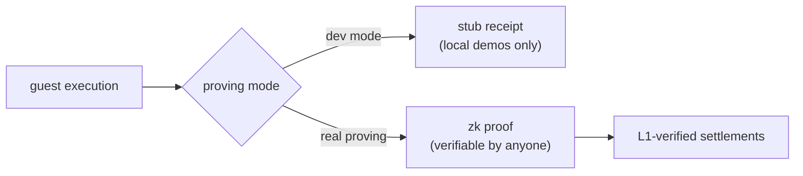

# The zkVM, briefly

The engine under everything is a **zero-knowledge virtual machine**, a
zkVM. This chapter is the minimum you need; it does not cover the
cryptography.

A zkVM runs an ordinary program (normal instructions, normal toolchain),
but alongside the result it produces a **receipt**: a small artifact that
proves "this exact program, on this exact input, produced this exact
output". Anyone can verify the receipt in milliseconds, without re-running
the program and without trusting whoever ran it. The key property:
verification cost is nearly independent of execution cost. A program may
run for an hour; its receipt still checks in milliseconds and is only a
few kilobytes.

Verification takes three things: the receipt, the journal (the claimed
output record), and the image id (the hash of the program binary).
The exact input is committed inside the receipt itself; the journal is
the output the outside world checks. Given all three, the zkVM's
verifier answers one question, did this exact program produce this
exact output, and it answers by checking the mathematics inside the
receipt, never by re-running the program. Underneath, that mathematics
is polynomial arithmetic; this book stays at that level.

## The journal: what the proof claims

The journal deserves a second look, because everything downstream
hangs from it. It is the guest's public output, its stdout, and it is
one of the parameters zk verify takes: a receipt does not verify
against "this program ran somehow", it verifies against this exact
program, that exact input, and exactly this journal. That turns the
journal into the proof's claim. A batch proof's journal states one
transition, "from this previous state root, lane tip and L1 context,
to this new one"; the aggregator compounds a run of such claims; the
bundle proof's journal is the claim the settlement submits. L1 never
stores the journal. When the settlement script runs zk verify, it
hashes its own on-chain numbers into the journal digest the receipt
must commit, so the proof only holds for exactly the values on the
chain ([How it all chains](chaining.md) follows the chain of digests; the
script side is the last section of this chapter).

## What vprogs uses today

vprogs is built on **[RISC0](https://risczero.com)**, a zkVM for RISC-V programs. The proving
pipeline is three guest programs, each an ordinary program binary (in
RISC-V ELF form) with its own
*image id*:

- the **transaction guest** is the application itself: tt's runtime and
  rules, compiled with the framework's runtime processor. It executes one
  transaction's actions against state and produces the per-transaction
  proof.
- the [**batch guest**](https://github.com/kaspanet/vprogs/tree/055ae28a/zk/batch-prover) verifies a block's transaction receipts and
  compounds them into one proof per batch.
- the [**aggregator**](https://github.com/kaspanet/vprogs/tree/055ae28a/zk/aggregate-prover) compounds a run of batch proofs into the single proof
  a settlement carries: the bundle proof.

How does one proof cover another? The zkVM exposes verification to
the guest itself, so the batch guest checks each transaction receipt
while it runs, and the aggregator checks each batch receipt the same
way. Each level's proof then covers the checks it did, which is how
proofs nest.

All three image ids are pinned at bootstrap, alongside the covenant id
([The transaction vocabulary](transactions.md)),
and every proof names the exact images its guest ran, so "the rules" are
never an ambiguous reference. One property of the pipeline matters for
everything downstream: bundles prove in sequence, each on top of the last,
because each bundle's journal continues the previous one. That is what
makes the digest chain a chain.

The sequence also shapes latency. A prover that keeps up stays a fixed
distance behind the chain; one that cannot keep up falls behind without
bound, so settlements wait and exits wait to be committed: the same
liveness exposure [The machinery](machinery.md) names.

Recovery is catching up: a stalled machine proves a larger window that
reaches a recent block, then settles again. The anchor-window limit and
that recovery are the [settlement appendix](appendix-settlements.md#the-anchor-window-and-the-long-stall)'s subject.

And where does verification happen? On-chain, in consensus. Kaspa's script
engine ships a zk-verify opcode ([KIP-16](https://github.com/kaspanet/kips/blob/master/kip-0016.md), activated with Toccata, a Kaspa network upgrade); the
settlement's script calls it with the receipt, and every Kaspa node
executing that transaction runs the check. The verifier identity (which
image ids, which proof system)
is baked into the covenant's script hash, so "which rules am I trusting?"
and "which address did I pay?" are the same question. And the receipt
cannot be paired with mismatched claims. The script itself hashes the
settlement's named values (state digests, lane tip, block point,
commitments) into the journal digest the receipt commits. A proof for
one state simply fails against script data naming another.

Two modes matter in practice:

- **Dev mode**: the prover emits stub receipts instead of real proofs.
  Instant, free, and completely unsafe: fine for a local simnet demo,
  worthless on a public network. A dev covenant's [script omits the proof
  check](https://github.com/kaspanet/vprogs/blob/055ae28a/zk/backend/risc0/covenant/src/script.rs#L249), so on a public network its continuation is spendable by anyone,
  and no one would or should hold money in it.
- **Real proving**: actual cryptographic proofs, GPU-produced. tt's
  testnet deployments settle with real proofs.

## What may come

The zkVM field is new and still changing. vprogs' proving stack sits behind
a [backend interface](https://github.com/kaspanet/vprogs/blob/055ae28a/zk/vm/src/backend.rs#L15): execution, proving, and verification each sit behind
one standard interface, and
RISC0 is currently the one implementation behind them. That seam is what
makes "another zkVM tomorrow" a migration rather than a rewrite. The
interface exists today; a second implementation does not.

One more property: since the guest is an ordinary program, the program's
*rules and its runtime* ride inside the same proof. On smart-contract
platforms that is precisely what you cannot do, which is the [next
chapter](solana.md)'s subject.
