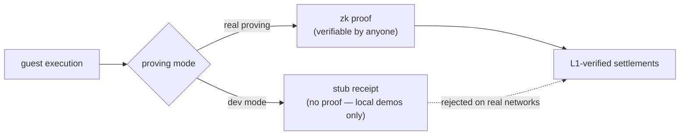

# The zkVM, briefly

The engine under everything is a **zero-knowledge virtual machine** — a
zkVM. This chapter is the minimum you need; the cryptography stays in its
box.

A zkVM runs an ordinary program — normal instructions, normal toolchain —
but alongside the result it produces a **receipt**: a small artifact that
proves "this exact program, on this exact input, produced this exact
output". Anyone can verify the receipt in milliseconds, without re-running
the program and without trusting whoever ran it. The magic, such as it is:
verification cost is nearly independent of execution cost. A program may
run for an hour; its receipt still checks in a blink. Think of it as a
notarized execution transcript — except the notary is mathematics, and the
transcript is a few kilobytes.

## What vprogs uses today

vprogs is built on **RISC0**, a zkVM for RISC-V programs. The guest code —
tt's runtime, rules, and state — compiles to a RISC-V ELF; that ELF's
*image id* is pinned into the covenant at bootstrap and recorded in every
proof journal, so "the rules" are never an ambiguous reference: a proof
always names the exact program image it executed. Proofs are produced in
the three stages from chapter 5 and compounded into the one a settlement
carries.

Two modes matter in practice:

- **Dev mode** — the prover emits stub receipts instead of real proofs.
  Instant, free, and completely unsafe: fine for a local simnet demo,
  worthless on a real network (and rejected there).
- **Real proving** — actual cryptographic proofs, GPU-produced. tt's
  testnet deployments settle with real proofs.

The same guest and the same settlement layout — but not the same
security: a dev settlement's script skips the on-chain proof verification
entirely, which is why dev mode is never anything more than a local demo.

## What may come

The zkVM landscape is young and moving. vprogs' proving stack sits behind
a backend interface — execution, proving, and verification are traits, and
RISC0 is currently the one implementation behind them. That seam is what
makes "another zkVM tomorrow" a migration rather than a rewrite:
*outlook, not promise* — but the door is a real, existing interface, not a
hope.

One more thing the zkVM buys, easily underrated: since the guest is an
ordinary program, the program's *rules and its runtime* ride inside the
same proof. Which is exactly where the next chapter picks up — because on
smart-contract platforms, that is precisely what you cannot do.
